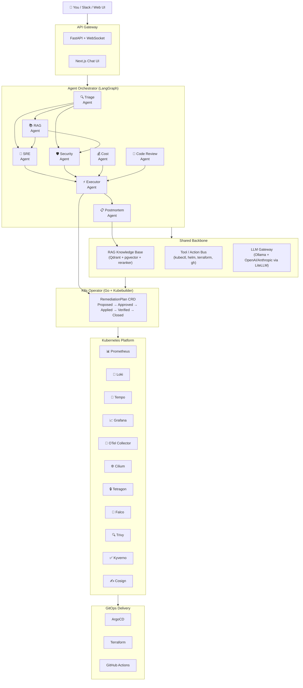

<p align="center">
  
</p>

<h1 align="center">🛡️ Sentinel</h1>
<p align="center">
  <strong>AI-Native DevSecOps & SRE Platform</strong>
</p>
<p align="center">
  A self-hosted platform where specialized AI agents monitor your infrastructure,
  triage incidents, answer questions via RAG, harden security, and self-heal —
  running on Kubernetes with full observability and GitOps delivery.
</p>

<p align="center">
  <a href="#architecture">Architecture</a> •
  <a href="#features">Features</a> •
  <a href="#tech-stack">Tech Stack</a> •
  <a href="#getting-started">Getting Started</a> •
  <a href="#roadmap">Roadmap</a>
</p>

---

## The Problem

Small teams and solo developers cannot afford a 24/7 SRE + Security team.
When something breaks at 3am, logs are scattered, runbooks are ignored under
pressure, security alerts pile up, and repeat incidents happen because
knowledge never gets captured.

## The Solution

Sentinel acts like a **tier-1 on-call engineer** that never sleeps:

1. **Detects** anomalies.
2. **Retrieves** relevant runbooks and past incidents via RAG.
3. **Diagnoses** root cause across multiple specialized AI agents.
4. **Proposes** (and with approval, **executes**) a remediation.
5. **Writes a postmortem** and feeds the lesson back into the knowledge base.

This creates a **closed learning loop** — every incident makes Sentinel smarter.

---

## Architecture



---

## Features

| Feature | Description |
|---|---|
| **🔍 Ask Sentinel** | Chat interface: ask questions about your cluster and codebase, get grounded answers with citations. |
| **⚡ Self-Healing** | Detect → diagnose → plan → (with approval) fix → verify → postmortem. Closed loop. |
| **🛡️ Security Autopilot** | Tetragon/Falco runtime events feed the Security Agent; auto-cordons compromised nodes. |
| **💰 Cost Cop** | Flags idle/over-provisioned resources; generates Terraform PRs for right-sizing. |
| **📝 Code Review Agent** | Reviews Helm/Terraform/Docker PRs for best practices and policy violations. |
| **📚 Self-Updating KB** | Every postmortem is auto-embedded into the vector DB — instant recall next time. |

---

## Tech Stack

| Layer | Technology |
|---|---|
| **Cluster** | kind (dev) / cloud K8s (prod) |
| **Agents** | LangGraph (Python) |
| **LLM Gateway** | LiteLLM → Ollama (local) + OpenAI/Anthropic (cloud) |
| **RAG** | LlamaIndex + Qdrant + pgvector + BGE reranker |
| **Operator** | Go + Kubebuilder |
| **API** | FastAPI (Python) + WebSocket |
| **Frontend** | Next.js + React + TypeScript |
| **GitOps** | ArgoCD + Helm |
| **IaC** | Terraform / OpenTofu |
| **CI/CD** | GitHub Actions |
| **Observability** | Prometheus + Loki + Tempo + Grafana + OTel |
| **Security** | Cilium (eBPF) + Tetragon + Falco + Kyverno + Trivy + Cosign |
| **Data** | PostgreSQL + Redis |

---

## Monorepo Structure

```
sentinel/
├── operator/          Go + Kubebuilder Kubernetes operator
├── agents/            Python agent definitions (LangGraph)
├── rag/               Python RAG pipeline (LlamaIndex, Qdrant)
├── api/               Python FastAPI backend
├── frontend/          Next.js chat UI + dashboards
├── infra/             Terraform / OpenTofu provisioning
├── gitops/            Helm charts & K8s manifests (ArgoCD source)
├── docs/              Architecture docs, runbooks, agent designs
├── scripts/           Utility & automation scripts
├── memory/            Project state & decisions (LLM context)
├── tasks/             Build plan & task tracking
└── README.md          ← You are here
```

---

## Getting Started

> ⚠️ **This project is under active development.** Full quick-start
> instructions will be added as each phase completes.

### Prerequisites
- Docker
- kind
- kubectl
- Helm
- Terraform / OpenTofu
- Go 1.22+
- Python 3.12+
- Node.js 20+
- Ollama

### Quick Start (Phase 0 — coming soon)
```bash
git clone https://github.com/yessine15/sentinel.git
cd sentinel
./scripts/kind-up.sh           # Create local K8s cluster
# ArgoCD, Prometheus, Loki, Grafana auto-deployed via GitOps
```

---

## Roadmap

| Phase | Focus | Status |
|---|---|---|
| **Phase 0** | Foundations — cluster, GitOps, observability | 🔲 Not started |
| **Phase 1** | RAG core — vector DB, retrieval, `/ask` endpoint | 🔲 Not started |
| **Phase 2** | Single agent SRE — live cluster chat | 🔲 Not started |
| **Phase 3** | Multi-agent + operator — self-healing loop | 🔲 Not started |
| **Phase 4** | Security hardening — eBPF, policies, signing | 🔲 Not started |
| **Phase 5** | Polish, evals, portfolio — demo video, blogs | 🔲 Not started |

---

## Skills Demonstrated

`Kubernetes (advanced)` · `Operator pattern` · `GitOps` · `IaC` ·
`DevSecOps` · `Supply chain security` · `eBPF` · `Observability` ·
`SRE practices` · `SLOs` · `Multi-agent systems` · `Production RAG` ·
`LLMOps / evals` · `Go` · `Python` · `TypeScript` · `System design`

---

## License

[MIT](LICENSE)

---

<p align="center">
  Built with ☕ and curiosity by <a href="https://github.com/yessine15">yessine15</a>
</p>
